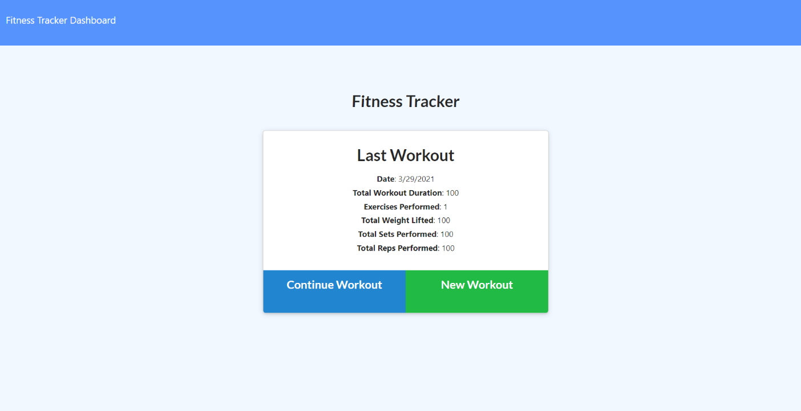
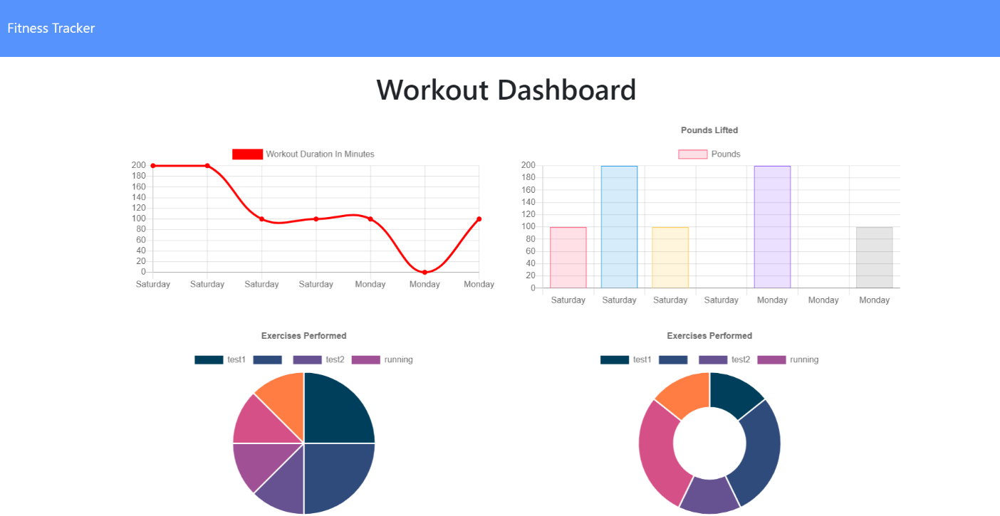
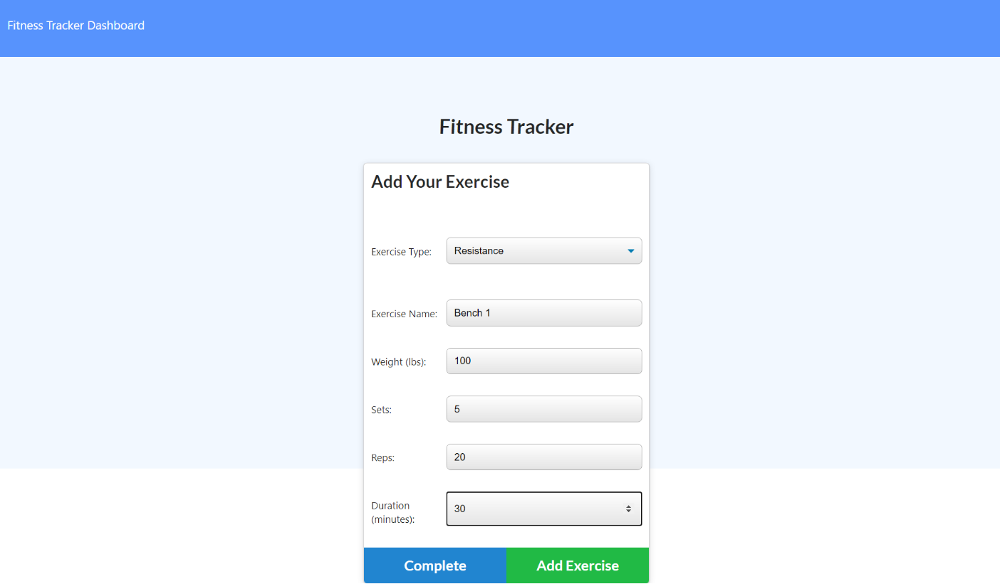

# Workout-Tracker

## Table of Contents

* [Introduction](#Introduction)
* [Installation](#Installation)
* [License](#License)
* [Screenshot](#Screenshot)
* [Link](#Link)

## Introduction

* Workout tracker application, allow user to view create and track daily workouts.user will be able to log multiple exercises in a workout on a given day and track the name, type, weight, sets, reps, and duration of exercise. If the exercise is a cardio exercise, user will be able to track  distance traveled.

## Installation

* node js 
* Visual Studio Code 1.51.1
* express
* express handlebars
* MongoDB

## License

## Screenshot

## Link

* Link: https://stormy-refuge-95710.herokuapp.com/?id=606272ae0760a9001569cb59

